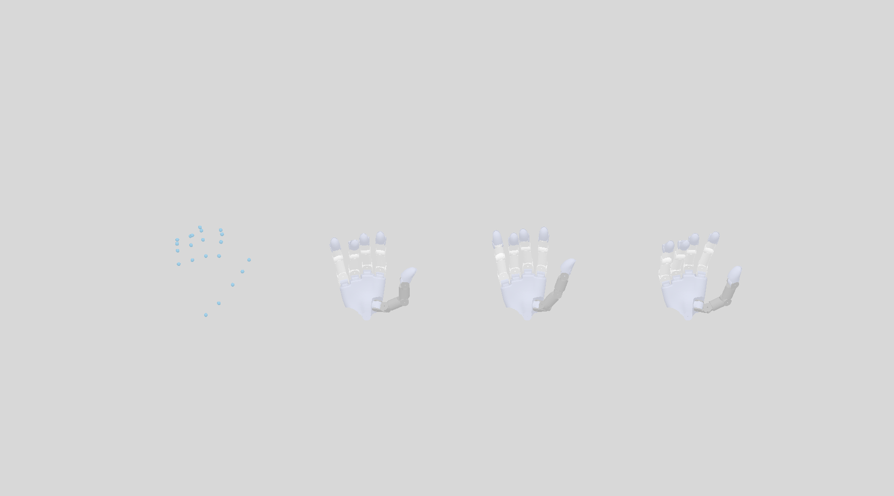

# GeoRT Wuji 灵巧手重定向改进技术报告

> 历史阶段报告。最终视频与收尾判断见 [最终结论](FINAL_CONCLUSION.md)；最终第1列使用当前数据重训的主分支模型，不能用本报告中的旧 Original 数值替代。

**状态：冻结候选与独立测试结论，2026-09-17。** 本文汇总当前代码、训练方案、验证集选型、独立测试集和 PD 仿真准备状态。GeoRT R2 已在独立 `test01` 的共同几何指标上取得当前最佳结果，但尚未完成全量 PD、真实接触、真机和跨操作者验收，因此继续作为冻结候选，不自动替换生产 Wuji 或默认 GeoRT 模型。

## 摘要

本项目解决 Manus 手部骨骼到 Wuji 灵巧手之间的构型歧义。仅使用指尖位置时，同一目标可能由多组机器人关节实现；原始 GeoRT 因而可能出现指节反弯、相邻手指穿透、近捏合偏移或局部响应不稳定。改进目标不是单独消除视觉反弯，也不是复制人手关节角，而是在机械边界内同时保留末节方向、多指开口、精细响应和可执行构型。

项目建立了三个独立 Manus 会话：`train01`、`val01` 和 `test01`，每个会话包含相同的九类动作但不跨 split 混用。输入从原始指尖扩展为指尖与真实骨段轴；模型从旧的逐指映射逐步形成可选骨骼分支和全手上下文；训练增加真实几何碰撞监督及局部位移响应目标。所有新能力显式启用，旧输入、旧 checkpoint 和旧推理路径继续兼容。

最终冻结的 R2 使用骨骼输入、逐指网络和有界全手上下文。它没有使用机器人关节真值或 Wuji teacher。在完整独立测试集的 20,989 条读数上，R2 相比生产 Wuji 将末节方向误差从 13.74° 降至 5.63°、开口代理误差从 7.20 mm 降至 3.02 mm、超过 2 mm 的共同资产自穿透从 18.22% 降至 1.06%，0.5–10 mm 动作响应方向误差从 14.21° 降至 12.90°。

这些结果证明 R2 在当前操作者、当前标定和共同几何评价下具有显著综合优势，但不等价于部署验收：近闭合缺少指腹接触真值；SDK 内部配置不透明；全量 PD 统计尚未完成；没有连接灵巧手、验证力控或测量真实延迟。因此当前决定是保留 R2、完整交付复现与预览工具，生产方案暂不切换。

## 1. 目标与验收原则

好的重定向应在人与机器人结构不一致时，保留任务相关的动作关系、接触方式和可理解手型，使操作者能够连续、精细、低负担地调用机器人的有效能力。评价必须同时覆盖：

- **方向与手型：** 末节骨轴和弯曲分配能表达输入姿态，而非只复现指尖坐标。
- **多指关系：** 张开、近捏合及拇指与其他手指的相对关系不应被单一姿态损失破坏。
- **精细控制：** 小输入需要方向合理、增益稳定且无明显低响应区。
- **可执行性：** 输出保持机械限位，并尽量避免共同资产上的自穿透。
- **时间与执行：** 模型目标、滤波输出、PD 实际状态和真实硬件必须分开报告。

反弯率、某个 loss 或相对父模型的位置保持都只是局部指标。模型是否值得替换必须由多目标验证、冻结后的独立测试及执行链路共同决定。

## 2. 数据与对照体系

### 2.1 正式 Manus 数据

正式数据由同一匿名操作者、同一已目视核验校准的三个独立会话组成：

| Split | 会话 | 动作片段 | 有效读数 | 用途 |
|---|---|---:|---:|---|
| train | `train01` | 9 | 20,990 | 训练和训练几何监督 |
| validation | `val01` | 9 | 20,988 | checkpoint 选择与门槛判断 |
| test | `test01` | 9 | 20,989 | 冻结后首次完整评估 |

九类动作包括 neutral、三种分支构型、pinch_axis、micro、context、open_close 和 wrist。原始分块、来源索引、会话边界、21 点映射、掌坐标逆变换及 SHA-256 均保留。训练和相邻帧评价不会跨片段传播 Wuji 热启动、滤波或时间差分。

采集保存了主机时钟，但 SDK 没有提供可信设备采集时间、帧号或置信度，因此当前数据适合静态几何及相邻读数分析，不支持端到端延迟、传感器速度或抖动频谱结论。三组会话属于同一操作者和标定，测试独立于训练与选型，但不是跨人泛化。

### 2.2 三类主要对照

最终报告固定比较：

1. **GeoRT R2，LP=0.3：** 本项目冻结候选；
2. **生产 Wuji，LP=0.3：** 用户确认的仓库版 `wuji-retargeting` 配置；
3. **Wuji SDK 2026.8.31：** 保留不透明的内置状态和滤波。

生产 Wuji 和 SDK 使用其原生预处理、资产与状态，再按关节名映射到共同 GeoRT 精确 FK 和碰撞资产进行评价。这个设计提供统一输出指标，但不能把所有差异归因于求解算法。

SDK 包内 Hand2 右手 URDF 与生产仓库原生 URDF 的 26 个关节定义一致；替换该资产不会改变旧求解器输出。SDK 与生产配置仍有约 14.8° 平均关节差，骨段尺度只能解释部分差异。公开 SDK 不提供内部尺度、目标、正则、滤波参数或未滤波输出，故不能声称两者内部等价，也不能把 SDK 差异解释为单一算法升级。

## 3. 方法

### 3.1 可观测输入与兼容边界

新模型支持 `manus_v1` 输入：每指指尖、三段单位骨轴及有效性信息。骨轴能描述骨段方向，但没有绕骨轴旋转，不能作为完整指腹朝向。非有限、退化或缺失输入通过 mask 处理，不将补零当作有效监督。

旧 H1 使用旧数据和冻结基础网络，其 BatchNorm 统计与新输入分布不匹配，在正式验证数据上出现饱和和畸形握拳。当前 M0/M1 重新按 `train01` 统计量归一化，移除不适用的旧 BatchNorm 和固定残差限制，全部权重可学习。M0 只读指尖；M1 在相同结构、参数量、初始化、预算和 seed42 下读取骨轴，因此 M0/M1 差异才是骨骼信息的受控对照。

### 3.2 骨骼信息的作用

在完整 `val01` 上，M0/M1 的末节方向误差分别为 5.21°/3.70°；M1 在严格近同指尖、多方向样本上也能表达更大的方向变化。例如 `ring_branch` 小指的不重复配对中，人手方向变化为 21.45°，M1 为 20.42°，生产 Wuji 为 4.05°。

这证明骨骼信息在当前数据中存在可观测收益，但它不是全面优势：M1 开口代理略差于 M0，未滤波局部位移响应也没有普遍优于 M0；部分近同指尖样本通过方向变化换取了更大的机器人指尖漂移。骨骼输入解决的是信息缺失，不会自动处理碰撞、接触和精细控制。

### 3.3 两轮冻结优化

第一轮 R1 从 M1 继续训练，保留逐指网络和骨骼输入。训练使用输出附近的真实 SAPIEN 穿透深度拟合可微碰撞代理，并加入真实相邻姿态对的局部位移响应项。历史碰撞分类器在 M1 输出上的大于 2 mm 穿透检出率只有 46.95%，因此没有复用为最终判断。

第二轮 R2 从 R1 开始，增加 `75→64→20` 的全手上下文分支。输出层零初始化，使初始输出与父模型一致；有界 `tanh` 组合继续保持关节限制。同时刷新几何难例采样，将碰撞权重从 1 提升至 2、响应权重从 0.2 提升至 1。

R2 是组合修正，未进行纯上下文消融，不能把全部改善单独归因于全手上下文。碰撞代理对 R1 难例的检出率提高到 63.93% 后仍不完整，因此 checkpoint 选择和报告指标始终以共同 SAPIEN 资产的实际几何穿透为准，不用代理网络分数冒充结果。

### 3.4 输出与执行层次

评价链分为四层：

1. 网络/求解器目标关节；
2. LP 滤波后的目标；
3. SAPIEN PD 执行后的实际状态；
4. 真机执行与任务结果。

Stage 5/6 的主表属于第 2 层加静态精确 FK/碰撞评价。PD 同屏工具已经实现第 3 层：三种方法分别运行在独立、相同参数的物理场景中，固定手腕，按相同输入时间推进，不用逐帧 `set_qpos` 冒充控制。真机层当前未运行。

## 4. 验证集：两轮优化如何形成 R2

训练仅使用 `train01`；`val01` 用于选 step2000 和停止决策。方向、开口按九个动作等权；共同碰撞使用固定 1,800 条读数。R2 和生产 Wuji 都显式采用 LP=0.3，SDK 保留内部状态。


| 条件 | 末节方向误差 | 开口代理误差 | 穿透 >2 mm | 穿透 >5 mm |
|---|---:|---:|---:|---:|
| M1，未滤波 | 3.70° | 4.21 mm | 45.56% | 16.00% |
| R1，未滤波 | 4.45° | 3.20 mm | 3.39% | 1.67% |
| R2，未滤波 | 4.92° | 2.93 mm | 1.22% | 0.78% |
| R2，LP=0.3 | **5.38°** | **3.18 mm** | **1.44%** | 0.89% |
| 生产 Wuji，LP=0.3 | 12.80° | 7.56 mm | 10.11% | **0.72%** |
| SDK，内部状态 | 13.27° | 5.60 mm | 25.94% | 3.33% |

R2 相比 M1 牺牲约 1.2° 方向精度，换来显著更少的自穿透和更小的开口误差。整体比例已经优于生产 Wuji，但逐任务检查仍发现 `open_close` 深穿透偏高：R2 LP 大于 5 mm 的比例为 4.5%，生产 Wuji 为 0.5%。此外，R2 在人手开口小于 15 mm 时的机器人 site 间距更大，不能据此宣称捏合接触更好。

按预先约定的两轮预算和停止规则，验证结束后不启动第三轮；冻结 R2，再首次解封测试集。

## 5. 独立测试集结果

`test01` 覆盖全部九段、20,989 条有效读数，无遗漏、无挑选、无碰撞抽检。模型、尺度、配置和 checkpoint 在查看结果前已经冻结；测试后没有重训或重新选权重。


| 全量合并指标 | GeoRT R2 | 生产 Wuji | SDK |
|---|---:|---:|---:|
| 末节方向误差均值 | **5.63°** | 13.74° | 12.84° |
| 末节方向误差 P95 | **14.77°** | 27.24° | 22.64° |
| 开口代理误差均值 | **3.02 mm** | 7.20 mm | 5.73 mm |
| 开口代理误差 P95 | **8.12 mm** | 13.76 mm | 16.03 mm |
| 自穿透 >2 mm | **1.06%（222 条）** | 18.22%（3,824 条） | 27.56%（5,785 条） |
| 自穿透 >5 mm | **0.07%（15 条）** | 1.79%（376 条） | 3.85%（809 条） |
| 0.5–10 mm 响应方向误差 | **12.90°** | 14.21° | 21.57° |
| 平均增益偏离 1 | **0.421** | 0.429 | 0.510 |
| 低响应比例 | **0.127%** | 0.242% | 1.171% |

方向统计覆盖 104,945 个指尖方向，开口统计覆盖 83,553 个有效拇指—其他手指关系，0.5–10 mm 响应统计覆盖 24,348 次指尖位移。按九段等权后，R2 的方向和开口排名不变；方向误差在全部九段均低于两个对照，并非由长片段加权造成。

三种主要方法没有关节越界或 PIP/DIP 低于 −15°的记录，生产 Wuji 求解异常/回退为 0。R2 在当前共同几何体系中的优势是完整且可复现的，而不是早期只针对小指反弯的局部改善。

测试结果仍有明确边界：

- 人手间距小于 15 mm 时，R2 的拇食/拇小 site 间距为 15.22/15.95 mm，生产 Wuji 为 11.89/10.42 mm；缺少指腹表面和接触真值，不能判定哪一种真实捏合更好。
- 共同 SAPIEN 资产用于公平几何比较，不是实机碰撞发生率或安全认证。
- SDK 内部状态不可观测，当前数据只能评价实际输出，不能解释内部原因。
- `test01` 是独立会话，但仍是同一操作者和同一校准，不能外推到跨人泛化。

## 6. PD 仿真状态

三方法同屏 PD 回放已实现，默认从左到右显示人手、R2、生产 Wuji 和 SDK。三个机器人运行在独立物理场景中，统一参数为 `kp=400`、`kd=10`、力矩上限 `10 Nm`，假定输入 60 Hz、控制 600 Hz、物理 1200 Hz。每段起点从共同限位内零位和零速度重置，随后只更新 drive target。



图中是第 20 个同步输入后的 PD 实际姿态，不是模型目标的逐帧瞬移。离屏图不包含交互窗口的文字面板；交互模式会另外显示当前片段、总进度和三路关节跟踪误差。

目前完成：

- 120 帧三路 headless 物理计算，输出完整性和协议文件通过；
- 20 帧实际 GUI 回放及截图检查；
- 固定根姿态、片段 reset 可重复性和 7 项控制时序/相机测试通过。

120 帧 smoke 的关节跟踪平均绝对误差约为 R2 0.249°、生产 Wuji 0.184°、SDK 0.296°；该片段是 neutral 起始过渡，只用于链路检查，不能排名三种方法。完整 20,989 帧 PD 记录尚未完成，Stage 6 的模型目标指标不能直接解释为 PD 实际结果。

上述 PD 参数是统一仿真对照，并未标定成 Wuji 真实电机、负载、摩擦或控制器模型。当前没有真实灵巧手安全、跟踪或任务成功证据。

## 7. 当前版本决策

### 已有充分证据保留

- 正式 Manus 采集、会话级 split、来源清单和不可覆盖的数据准备流程；
- `manus_v1` 指尖/骨轴输入、有效性处理和旧模型兼容；
- M0/M1 受控输入消融及骨骼信息收益证据；
- 几何碰撞监督、真实穿透复核和局部响应诊断；
- R1/R2 两轮冻结训练、全手上下文接口和完整实验元数据；
- 原始 GeoRT、生产 Wuji、SDK、候选 GeoRT 的共同验证与测试工具；
- PD 同屏回放和实际状态导出工具。

### 冻结候选，不自动设为生产默认

R2 已通过当前独立测试集的综合几何比较，具备进入完整 PD 和真机验收的资格。它仍不自动替换生产 Wuji，因为缺少接触真值、全量 PD、真实执行器和操作者任务验证。

### 当前不能声称

- R2 的 site 间距代表真实指腹接触或抓取稳定性；
- 静态 SAPIEN 穿透比例等于实机碰撞概率；
- 相邻主机读数代表真实速度、延迟或抖动；
- SDK 与仓库版 Wuji 内部配置等价；
- 单操作者独立测试代表跨人、跨佩戴或跨校准泛化；
- 120 帧 PD smoke 已证明全测试集执行效果。

## 8. 下一步验收

在不重训 R2 的前提下，下一步按以下顺序进行：

1. 完成全 20,989 帧 PD 离线记录，分别报告目标—实际关节误差、实际 FK、实际穿透和片段起始过渡；
2. 对 `open_close`、`pinch_axis` 和小开口样本重点检查 PD 后的深穿透和接触间距；
3. 明确真实手指表面/指腹接触点，建立不以 site 重合为目标的接触评价；
4. 在用户确认的安全控制参数下进行真机空载慢速回放，再进入轻触和任务操作；
5. 增加至少另一操作者或重新佩戴/重新校准会话，检验输入归一化和骨骼收益能否迁移。

只有 PD、真实接触、真机和跨会话结果共同支持，才讨论切换生产模型；任何新增训练应另立协议，不能使用 `test01` 继续选型。

## 9. 复现与预览

```bash
conda activate geort
cd /home/xense-wufan/GeoRT

# 已录制验证数据：人手、SDK、生产Wuji、R2
python -m geort.mocap.live_comparison --sdk-reference \
  --checkpoint stage5_R2_seed42 --m1-filter lp03 \
  --replay data/manus/val01/open_close/keypoints.npy

# 完整独立测试结果重新生成到新目录；不运行模型
python scripts/report_full_test.py --output /tmp/geort-test-full-preview

# PD实际状态同屏回放；不会连接手套或机器人
python -m geort.mocap.replay_pd_comparison

# 有限帧PD复核，输出目录必须不存在
python -m geort.mocap.replay_pd_comparison --headless --frames 120 \
  --output /tmp/geort-pd-check
```

文档和证据索引：

- [原始开发目标](DEVELOPMENT_GOALS.md)
- [正式 Manus 数据就绪报告](STAGE4_DATA_READINESS.md)
- [M0/M1 骨骼输入结果](STAGE4_RESULTS.md)
- [操作差异与碰撞复核](STAGE4_DIFFERENCE_RESULTS.md)
- [SDK 条件对齐核验](SDK_EQUIVALENCE_RESULTS.md)
- [R1/R2 冻结验证结果](STAGE5_RESULTS.md)
- [独立测试协议](STAGE6_TEST_PROTOCOL.md)与[结果](STAGE6_RESULTS.md)
- [完整九段测试明细](../reports/stage6/full_report/RESULTS.md)
- [PD 参数与操作说明](PD_COMPARISON.md)

截至本文版本，训练、验证、冻结测试和报告生成均为本地结果；没有自动提交、推送、部署或实机驱动。R2 是当前最有证据的候选，但生产切换仍待执行层验收。
