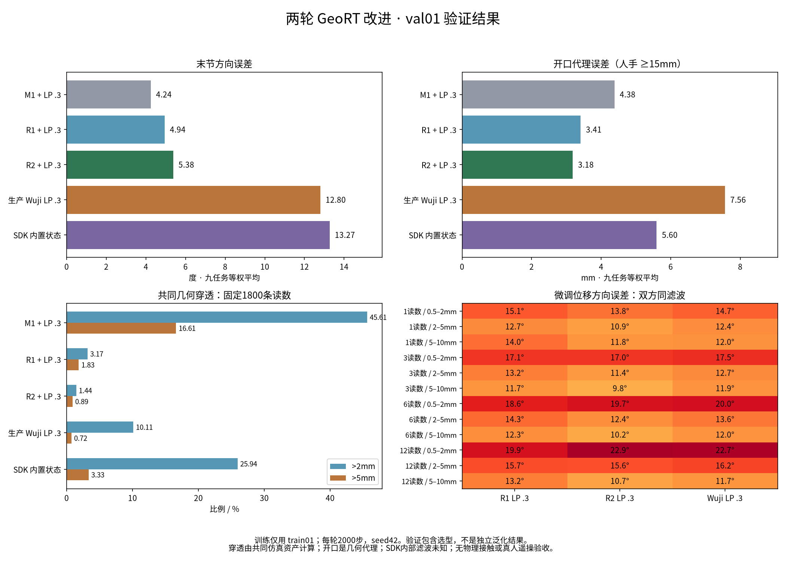

# 最后两轮 GeoRT 优化结果

> 历史阶段报告。最终视频与收尾判断见 [最终结论](FINAL_CONCLUSION.md)；最终第1列使用当前数据重训的主分支模型，不能用本报告中的旧 Original 数值替代。

后续更新：用户已授权对冻结R2进行完整测试集评估，结果见[Stage 6](STAGE6_RESULTS.md)。下文保留本轮结束时的验证集结果与停止决定；Stage 6没有新增训练。

2026-09-17。两轮均已完成，每轮主模型2000步、batch128、seed42；均按预先记录的评分选择step2000。**R2有实质改善，但尚未完整达到替代生产Wuji的标准；按两轮预算停止追加效果训练，保留候选和复现材料，继续以现用Wuji为生产方案。** 默认GeoRT入口的旧模型未替换，也没有第三轮、测试集模型推理、实机驱动或自动推送。

预览最终候选，与生产Wuji及SDK同场比较：

```bash
conda activate geort
cd /home/xense-wufan/GeoRT
# 已录制数据；双方显式采用LP=0.3，SDK内部滤波仍未知
python -m geort.mocap.live_comparison --sdk-reference \
  --checkpoint stage5_R2_seed42 --m1-filter lp03 \
  --replay data/manus/val01/open_close/keypoints.npy
# 真人Manus输入，仅仿真显示，不连接/下发灵巧手
python -m geort.mocap.live_comparison --sdk-reference \
  --checkpoint stage5_R2_seed42 --m1-filter lp03
```

界面从左至右：人手、SDK、生产Wuji、R2。按L切换候选滤波；微调复现把`open_close`换成`micro`。R1预览把checkpoint换成`stage5_R1_seed42`。优先检查握拳、重新张开及近捏合，而不是只看张手静态姿态。

## 改动与出发点

第一轮从M1权重继续训练，保留骨骼输入和逐指网络。旧碰撞分类器在M1真实输出上的>2mm检出率仅46.95%，因此改用训练会话映射输出附近的实际几何标签，学习可微穿透深度，并增加真实相邻姿态对的局部位移响应项。没有人机成对关节标签，也没有Wuji teacher。目标是减少不可执行构型，同时让小幅动作产生合理位移。

第一轮残余问题集中在握拳深穿透和增益偏差。第二轮添加75→64→20的全手上下文分支，输出层零初始化保留父模型；通过有界tanh组合保持关节限制。刷新碰撞监督，增加局部难例采样，将碰撞系数从1提高到2，位移响应训练系数从0.2提高到1。原始模型及context关闭路径保持兼容。第二轮是组合修正，没有纯上下文消融，不能单独归因于上下文。

初次第二轮监督拟合对R1剩余穿透检出率仅44.26%，未用于主模型。训练几何难例重采样后提高到63.93%，仍不完整。因此选型和最终验收始终计算共同SAPIEN资产的实际穿透，不能用近似器分数冒充碰撞质量。两次监督准备均保留，详见[冻结协议](STAGE5_TWO_ROUND_PROTOCOL.md)。

新训练入口`geort/train_refinement.py`，几何监督`geort/collision_surrogate.py`与`geort/refit_collision.py`，可选上下文`geort/manus_model.py`。损失、初始化、采样、source/数据/权重哈希和实际源文件快照保存在各checkpoint；细项训练日志另存`reports/stage5/*training.log`。

## 共同验证结果

train01训练，val01选型及比较；val01共9段、20,988条主机读数。方向和开口按任务等权；开口是人手≥15mm区域的尺度校正几何代理；穿透检查与旧报告完全相同的1800条读数、相同碰撞资产。SDK2026.8.31与生产配置固定。旧模型输出数组与旧缓存逐元素相同。

| 模型/输出条件 | 末节方向误差 ° | 开口代理误差 mm | 穿透>2mm | 穿透>5mm |
|---|---:|---:|---:|---:|
| 原始GeoRT | 80.13 | 44.14 | 85.44% | 74.56% |
| M0 指尖 | 5.21 | 3.98 | 46.89% | 14.67% |
| M1 骨骼，未滤波 | 3.70 | 4.21 | 45.56% | 16.00% |
| R1，未滤波 | 4.45 | 3.20 | 3.39% | 1.67% |
| R2，未滤波 | 4.92 | 2.93 | 1.22% | 0.78% |
| R2，LP=0.3 | 5.38 | 3.18 | 1.44% | 0.89% |
| 生产Wuji，LP=0.3 | 12.80 | 7.56 | 10.11% | 0.72% |
| Wuji，未滤波 | 12.60 | 7.43 | 10.67% | 0.78% |
| SDK，内部状态 | 13.27 | 5.60 | 25.94% | 3.33% |



原始/滤波分别评估，不能拿无滤波GeoRT的即时响应与滤波Wuji混排。R2相对M1牺牲约1.2°平均方向精度，换来大幅减少穿透，不能称所有指标都提高。

逐指末节方向（任务等权）：

| 条件 | 拇指 | 食指 | 中指 | 无名指 | 小指 |
|---|---:|---:|---:|---:|---:|
| R2 LP=0.3 | 3.81° | 6.40° | 4.04° | 5.91° | 6.72° |
| 生产Wuji | 10.80° | 13.05° | 6.16° | 14.76° | 19.25° |

## 为什么尚未完整通过

- **方向、整体碰撞和中小开口通过数值门槛。** R2原始/LP两种条件的12个微调方向单元均不超过对应Wuji+2°；分别11/12单元绝对误差更低。七个样本数≥30的15–30/30–60mm开口单元均通过Wuji+1mm门槛。五指静态方向均更低，低响应比例没有单元更差。
- **深穿透仍集中在握拳。** open_close的>5mm比例：R1 10.5%，R2 4.0%，R2 LP 4.5%，生产Wuji 0.5%；R2 LP即200条中的9条，对照为1条。context中R2 LP为3.5%，生产Wuji为4.0%。其余七段R2抽检未出现>2mm穿透。不能用其他任务的零值掩盖握拳退化，整体通过不等于逐任务通过。
- **增益改善但同滤波优势不完整。** 原始R2相对Wuji_raw仅2/12单元的`mean(abs(gain-1))`更高；R1为11/12。双方LP=0.3时R2仍有7/12单元更高，差值约0.004–0.024，没有全面改善。输入相邻位移<0.1mm的输出位移代理：R2 LP均值0.113mm/P95 0.361mm，Wuji为0.108mm/0.340mm。它包含滤波追赶和真实细动，不能称传感器静止抖动或延迟测量。
- **近闭合仍需谨慎解释。** 人手开口<15mm时，R2的拇食/拇中/拇小site间距均值15.91/14.04/16.19mm；Wuji为11.86/9.02/10.01mm。site间距不是指腹表面接触真值，但此变化表明减少穿透没有自动证明捏合更好。近捏合样本分别仅43/73/54条，无名指没有该区间样本，不强制site重合来制造好成绩。

这些结果支持“R2比上一版明显进步”，尚不支持“真人操作全面优于Wuji”或“可以部署到实机”。遵守原定逐任务约束与两轮停止规则：当前不批准替代，不再启动第三轮；测试会话不解封作质量排名。保留R2预览供用户复核，但预览不是新的训练授权或默认模型切换。

## 验证与复现

本次23项定向测试通过：新位移loss有效性mask、片段边界、冻结碰撞网络的输入梯度；上下文初值完全一致、后续可学习和其他手指信息可达；旧Manus模型导出兼容、差异审计、实时队列、相机逻辑。R1/R2最佳模型导出最大关节误差分别2.18e-7/2.86e-7rad。R2离屏回放20条同步输入，SDK/Wuji/R2均运行成功；截图检查并修复了离屏相机宽高比导致左右列裁切的问题。

这些是本地代码/离线结果，未进行本轮真人遥操、物理接触、部署或远端CI验证。未连接Manus或灵巧手。

完整数据：`reports/stage5/validation_final/{metrics.json,outputs.npz}`、`reports/stage5/audit_final/{metrics.json,collision_depths.npz,gates.json}`；图片由JSON生成。SDK的官方变化及当前比较边界见[SDK核验报告](SDK_EQUIVALENCE_RESULTS.md)。

```bash
# 已有结果复核，无需再训练；输出必须使用新文件名
python scripts/summarize_refinement.py \
  --report reports/stage5/audit_final/metrics.json \
  --output /tmp/geort_stage5_gate_recheck.json
python -m unittest tests.test_refinement tests.test_manus_training \
  tests.test_difference_audit tests.test_live_comparison tests.test_replay_camera
```

冻结的训练复现命令如下，只作为复现记录；已有目录会明确拒绝覆盖，停止决定后没有再执行它们：

```bash
python -m geort.train_refinement --surrogate reports/stage5/collision_r1 \
  --output checkpoint/stage5_R1_seed42
python -m geort.train_refinement --parent stage5_R1_seed42 \
  --surrogate reports/stage5/collision_r2_focused --context \
  --collision-weight 2 --response-weight 1 --output checkpoint/stage5_R2_seed42
```
